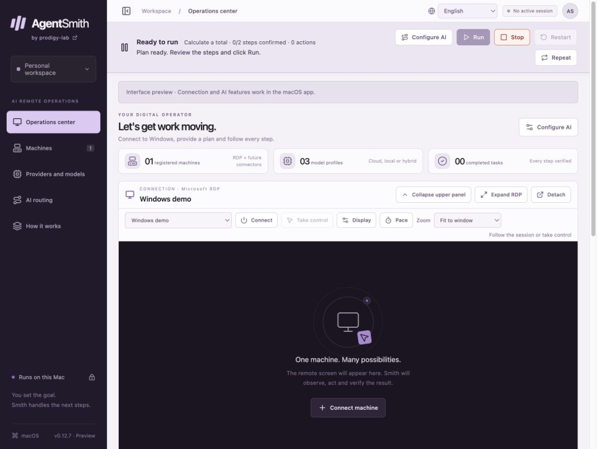
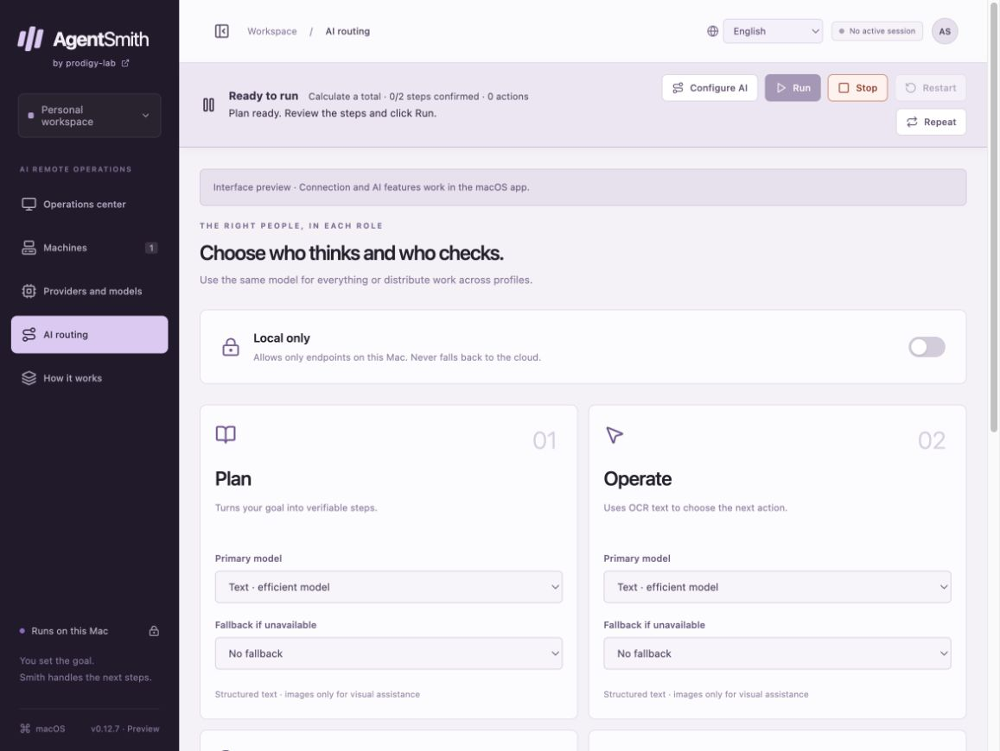

# AgentSmith

**Give your Windows workflow a plan, a remote session, and an AI operator.**

[by prodigy-lab](https://prodigy-lab.com/) · macOS first · English / Português (BR) / Español

AgentSmith is a desktop workspace for operating Windows computers from a Mac. Connect through Microsoft RDP, describe a task, review its steps, and let a supervised AI loop observe the screen, propose mouse and keyboard actions, and check the result.

**Preview 0.14.0** · Current build target: **Apple Silicon and macOS 26+**. RDP and RustDesk both carry AI sessions; the RustDesk transport has been verified against one live machine, video and input included, including two-factor machines. Windows as the controller and NanoKVM connectors are not implemented yet.



*Real application UI rendered in an isolated browser preview with fictional data. No live Windows session or completed automation is depicted. Native features require the desktop app.*

## Why AgentSmith

- **Work through existing Windows interfaces.** Use the same visible applications a person would operate, with one executor responsible for input.
- **Choose intelligence by role.** Assign separate models to planning, operation, verification, and visual assistance; keep expensive vision calls for situations that need them.
- **Start with local OCR.** Apple Vision extracts text and positions before a text model chooses the next action. Explicit text-and-region criteria can be checked directly by the engine.
- **Keep a person in control.** Review plans, pause, resume, stop, restart, edit, delete, and inspect progress. Already transmitted Windows actions cannot be undone by stopping.
- **Give the remote desktop room.** Collapse navigation and the upper panel, enter RDP focus mode, detach the view, and adjust zoom, resolution, and pacing.
- **Run locally or mix providers.** Use the built-in llama.cpp engine, a local compatible endpoint, or configured cloud profiles. Local-only routing blocks cloud inference.

These are design benefits, not a guarantee of lower cost or successful automation. Small models, OCR, and visual models can misread screens. Measure your own workflows before relying on unattended runs.

## What you can do today

| Area | Available in this preview |
| --- | --- |
| Remote Windows | Native FreeRDP session, screenshots, mouse clicks, typing, shortcuts, scrolling |
| RustDesk | Native session: authenticated and encrypted, VP8/VP9 video, mouse and keyboard, public or self-hosted server; manual web client still available |
| Plans | Generate verifiable steps; edit, reorder, delete, restart, and retain execution history |
| Operator | OCR-first text decisions, visual assistance, structured action validation, fresh-screen checks |
| Verification | Visual confirmation of text-proposed completion; explicit OCR criteria checked by the engine |
| Repetition | Duration, time windows, weekdays, start/end dates, interval between cycles |
| AI | Ten cloud-provider entries, official-client browser login for four providers, local endpoints |
| Integrated local vision | Downloadable SmolVLM 500M, Qwen2.5 VL 3B, and Qwen3-VL 2B presets |
| Privacy | macOS Keychain for saved credentials; local SQLite history; no continuous screen recording |
| Interface | English, Brazilian Portuguese, Spanish; lavender theme; collapsible layout |

## Start here

1. [Build and open the macOS application](docs/getting-started.md).
2. Add a Windows machine with RDP enabled and reachable from your Mac.
3. Add and test a model profile in **Providers and models**.
4. Configure the four roles in **AI routing**. Keep an image-capable profile in **Visual assistance**.
5. Connect, enter a small task, click **Prepare plan**, review the steps, then **Run**.

Try: “Open Calculator and calculate 125 + 375. Confirm the display shows 500.” Start from a known desktop state and supervise the run.

## Model choice without unnecessary expense

OCR runs in Apple Vision on the Mac; it does not need a paid LLM. Planning and most operation requests accept text models. Visual assistance needs an actual image-capable model; checking a box cannot add vision capability.

Use a model that passes **Test operator** and your own short Windows task. Keep the same text profile in Operate and Verify to allow a combined decision call. Use a stronger visual profile only when needed. More frequent frame capture does not itself trigger more LLM requests.

See [AI routing and performance](docs/ai-routing.md) for local, hybrid, and cost-conscious setups. Account access, model IDs, pricing, and official-client compatibility can change.

## Explore the interface

[View all English screenshots](docs/screenshots.md): operations, machines, RustDesk setup and two-factor verification, providers, routing, plan editing, repetition, and pacing.



## Documentation

| Guide | Contents |
| --- | --- |
| [RustDesk transport](docs/rustdesk.md) | Setup, authentication, video and input, current limits, licensing |
| [Getting started](docs/getting-started.md) | Requirements, build commands, first connection, everyday controls |
| [AI routing](docs/ai-routing.md) | Role selection, local models, performance, capability tests |
| [Architecture](docs/architecture.md) | Components, data flow, remote adapter boundary, persistence |
| [Operator harness](docs/operator-harness.md) | Action contracts, validation, recovery, provider-specific behavior |
| [OCR-first operation](docs/ocr-text-first.md) | Observation, caching, visual escalation, exact criteria |
| [Browser login](docs/browser-login.md) | Official clients, shared sessions, model access, troubleshooting |
| [Privacy and security](docs/privacy.md) | What leaves the Mac, stored data, limits and publication review |
| [Troubleshooting](docs/troubleshooting.md) | Connection, authentication, invalid actions, stalled plans |
| [Local vision measurements](docs/local-vision-validation.md) | Synthetic measurements and their limitations |
| [Changelog](CHANGELOG.md) | Changes through 0.14.0 |
| [Contributing](CONTRIBUTING.md) | Development, tests, useful bug reports |

## Build from source

Requires Node.js compatible with Vite 7, npm, Rust, Xcode Command Line Tools, Python 3.12+ for the engine archive script, and Homebrew FreeRDP 3.

```sh
git clone https://github.com/AleCyriaco/AgentSmith.git
cd AgentSmith
npm ci
brew install freerdp
npm run helper
npm run vision
npm run ocr
npm run desktop
```

To create the local application bundle:

```sh
npm test
cargo test --manifest-path src-tauri/Cargo.toml
npm run bundle
```

Output: `src-tauri/target/release/bundle/macos/AgentSmith.app`. This is a development build with local/ad-hoc signing, not a notarized installer. See [distribution notes](docs/distribution.md) before redistributing bundled dependencies.

## Current limits and roadmap

A reachable Windows RDP host and appropriate access are required. VPN or network outages cannot be solved by model routing. The Mac must stay awake with AgentSmith open; repetition is not a background system service. One remote session and one executor are supported.

The plan can still stop on an intermediate step even when the overall goal is already visible. OCR may miss icons or empty fields, and vision may choose incorrect coordinates. A valid JSON response is not proof that an action is correct. The app is a preview, not a universally reliable unattended operator.

Next priorities: goal-level reconciliation, task-based model evaluation, end-to-end validation of the RustDesk transport, NanoKVM adapters, broader macOS compatibility, notarized distribution, and a Windows controller. These are roadmap items, not available features.

## Project and third-party rights

AgentSmith is licensed under the [MIT License](LICENSE), permitting commercial use, modification, and redistribution with the copyright and license notice preserved. See [distribution notes](docs/distribution.md). Third-party engines, libraries, and model weights retain their own licenses and terms. AgentSmith is independent of the model providers and remote-access projects it integrates with.

## AgentSmith Pocket

Use your iPhone or Android to follow tasks, prepare requests, add guidance and approve individual actions over your private Tailscale network. Pocket is served by the Mac app; approvals appear directly in the panel, with optional SimpleX messaging. See [Pocket setup and limits](docs/pocket.md).

### Private SimpleX messaging

Host the messaging relay on your Mac and pair phones through a guided QR flow. See [SimpleX setup](docs/simplex.md) for prerequisites, pairing, privacy and external-server support.
