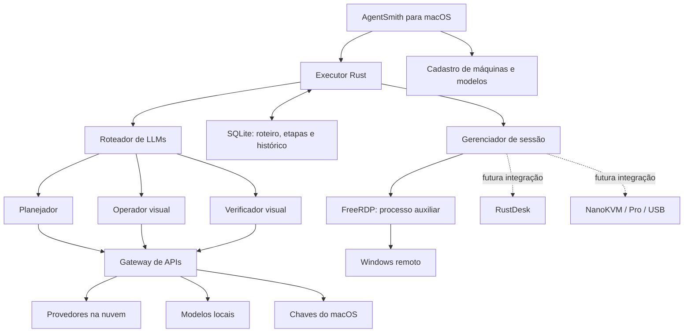

# AgentSmith — arquitetura e escopo da primeira versão

Atualizado em 6 de setembro de 2026.

## Decisões principais

- Nome: **AgentSmith**.
- Plataforma inicial: **macOS**. O pacote compilado neste Mac usa **Apple Silicon e macOS 26 ou posterior**, conforme as bibliotecas nativas disponíveis. Intel e sistemas anteriores exigem uma compilação própria e validação.
- Interface: Tauri 2, React e TypeScript.
- Núcleo local: Rust, executor assíncrono e SQLite.
- Credenciais: Chaves do macOS, separadas dos cadastros e vinculadas ao endpoint correspondente.
- Primeiro transporte implementado: FreeRDP, em processo auxiliar com imagem da sessão e entradas de mouse/teclado.
- IA: vários perfis de modelo, vários provedores e três rotas independentes: planejamento, operação e verificação.
- Modo somente local: permite apenas endpoints de IA em localhost/loopback, sem alternativa automática na nuvem.

## Estrutura



O aplicativo mantém um único executor ativo e uma única sessão remota por vez nesta prévia. Várias máquinas e vários perfis podem ser cadastrados. Paralelismo entre máquinas é uma evolução posterior, com uma trava de controle por sessão.

## Dez fornecedores iniciais

A seleção reúne cinco fornecedores dos EUA e cinco da China com APIs relevantes ao projeto. Não é um ranking auditado de faturamento, usuários ou participação de mercado. O catálogo de modelos permanece configurável, porque modelos, capacidades, regiões e permissões mudam.

| Fornecedor | Origem | Famílias | Integração nesta base | Fonte oficial |
|---|---|---|---|---|
| OpenAI | EUA | GPT | Responses API | [Documentação](https://developers.openai.com/api/docs/guides/images-vision) |
| Anthropic | EUA | Claude | Messages API | [Documentação](https://platform.claude.com/docs/en/api/overview) |
| Google | EUA | Gemini | Camada compatível com Chat Completions | [Documentação](https://ai.google.dev/gemini-api/docs/openai) |
| xAI | EUA | Grok | Responses API | [Documentação](https://docs.x.ai/developers/model-capabilities/text/generate-text) |
| Amazon | EUA | Nova e modelos disponíveis no Bedrock | Converse com chave de API Bedrock | [Documentação](https://docs.aws.amazon.com/bedrock/latest/userguide/api-keys.html) |
| Alibaba Cloud | China | Qwen | API compatível com Chat Completions | [Documentação](https://www.alibabacloud.com/help/en/model-studio/compatibility-of-openai-with-dashscope) |
| DeepSeek | China | DeepSeek | API compatível com Chat Completions | [Documentação](https://api-docs.deepseek.com/) |
| Moonshot AI | China | Kimi | API compatível com Chat Completions | [Documentação](https://platform.kimi.ai/docs/overview) |
| Z.ai / Zhipu | China | GLM | API compatível com Chat Completions | [Documentação](https://docs.z.ai/guides/overview/quick-start) |
| ByteDance / BytePlus | China | Seed / Doubao, conforme região | ModelArk compatível com Chat Completions | [Documentação](https://docs.byteplus.com/en/docs/modelark/1099455) |

Bedrock nesta prévia usa chave de API Bedrock, não Access Key/Secret Key IAM nem assinatura SigV4. O usuário informa a região e o ID de modelo ou perfil de inferência autorizado. Os endpoints internacionais sugeridos para fornecedores chineses também exigem uma conta e um modelo disponíveis na região selecionada.

Uma assinatura de um aplicativo de chat não deve ser presumida como credencial de API. Cada perfil recebe sua própria chave quando necessária.

### Modelos locais

| Servidor | Endpoint sugerido | Requisito |
|---|---|---|
| Ollama | `http://127.0.0.1:11434/v1` | Serviço iniciado e modelo instalado |
| LM Studio | `http://127.0.0.1:1234/v1` | Servidor iniciado e modelo carregado |
| llama.cpp ou outro servidor compatível | `http://127.0.0.1:8080/v1` | Endpoint Chat Completions compatível |
| Servidor baseado em MLX | Configurável | A implementação do servidor precisa expor API compatível; MLX sozinho não é um servidor HTTP |

[Ollama](https://docs.ollama.com/api/openai-compatibility), [LM Studio](https://lmstudio.ai/docs/developer/openai-compat), [llama.cpp](https://github.com/ggml-org/llama.cpp/tree/master/tools/server).

O AgentSmith não instala nem baixa pesos de modelos automaticamente. A memória necessária depende do modelo, da quantização, da janela de contexto e do processamento de imagens. Não se promete desempenho com base apenas no nome do Mac.

## Perfis e roteamento

Um perfil possui ID, fornecedor, nome, método de autenticação (`api_key` ou `browser`), URL base ou vínculo com cliente oficial, formato de API, modelo, habilitação de visão e estado ativo. Perfis antigos recebem `api_key` automaticamente. As credenciais ficam no cofre do sistema, nunca no SQLite.

Exemplos de perfis: “Planejador principal”, “Operador local”, “Verificador de revisão”. Um mesmo fornecedor pode aparecer em vários perfis, com modelos e endpoints diferentes.

- Planejador: transforma texto em etapas com condições de sucesso.
- Operador: recebe a imagem e escolhe uma ação de mouse ou teclado.
- Verificador: confere visualmente o resultado. Pode usar o mesmo modelo do operador ou outro perfil.
- Alternativa: é acionada em erros transitórios de transporte, HTTP 429 ou erro do servidor. Erro de autenticação, estrutura inválida ou recusa não se converte em tentativa de contornar a restrição.
- Somente local: exclui destinos externos antes de chamar a API. Redirecionamentos HTTP são recusados e o cliente ignora proxies do ambiente.

A capacidade visual pertence ao modelo. Marcar “aceita imagens” no cadastro é uma declaração de configuração, não uma certificação de qualidade visual. O teste do perfil atual confirma uma resposta de texto; a capacidade visual precisa ser validada com o modelo escolhido.

## Conexões remotas

### FreeRDP

O processo auxiliar autentica no Windows, decodifica a imagem com GDI e publica quadros BGRA. O núcleo os converte para PNG, disponibilizando a mesma imagem à interface e aos modelos visuais. Entradas são enviadas ao protocolo remoto, sem usar o mouse global do Mac.

O contrato atual contempla clique, clique duplo, clique direito, rolagem, texto Unicode e combinações de teclas. Operações são limitadas e a resposta do modelo é validada antes de qualquer entrada. A tela começa em 1280 × 800; redimensionamento gera uma nova observação. A comparação visual reduz o uso de coordenadas após mudanças grandes, mas ainda é uma heurística a validar em aplicações reais.

Certificados desconhecidos são recusados. Para um certificado próprio, o usuário pode cadastrar a impressão digital depois de confirmá-la com o administrador. Não há opção de ignorar a verificação TLS.

O Windows precisa ter um servidor RDP disponível, uma edição compatível, usuário autorizado e conectividade. Windows Home não oferece o host RDP nativo. A prévia não inclui configuração de VPN, RD Gateway, autenticação interativa Entra, redirecionamento de arquivos, áudio nem múltiplos monitores. [Requisitos Microsoft](https://learn.microsoft.com/en-us/windows-server/remote/remote-desktop-services/remotepc/remote-desktop-allow-access), [FreeRDP](https://github.com/FreeRDP/FreeRDP).

### RustDesk

É uma integração futura. Requer uma ponte programática que exponha quadros e entradas; apenas iniciar a aplicação RustDesk não satisfaz esse contrato. Deve-se validar o caminho de integração, a manutenção das versões e o licenciamento do código que eventualmente for incorporado. [Projeto](https://github.com/rustdesk/rustdesk).

### NanoKVM e NanoKVM Pro

São integrações futuras por vídeo e canais de controle, com detecção de modelo, firmware e capacidades. A interface de navegador serve como caminho de compatibilidade, quando necessário. Não se presume uma API universal estável entre todos os firmwares. [NanoKVM](https://github.com/sipeed/NanoKVM), [NanoKVM-Pro](https://github.com/sipeed/NanoKVM-Pro).

### NanoKVM-USB

É uma integração futura de hardware conectado fisicamente. O vídeo chega via USB e o controle retorna ao dispositivo. Para acesso pela rede, um computador próximo precisa executar uma ponte. Uma WebView no macOS não deve ser presumida equivalente ao Chrome para APIs USB/serial; o adaptador nativo precisa ser validado. [Projeto](https://github.com/sipeed/NanoKVM-USB).

RDP e controle da console física não são intercambiáveis sem conferir a identidade, o usuário e a sessão. Uma futura troca de transporte deve reiniciar a observação e validar o contexto antes de continuar o roteiro.

## Roteiros e executor

1. O usuário escolhe a máquina e fornece o objetivo ou passo a passo.
2. O planejador produz até 30 etapas com ação e condição de sucesso.
3. O usuário revisa o plano e inicia a execução.
4. O verificador observa se a condição atual já foi atendida.
5. Se falta trabalho, o operador escolhe uma entrada estruturada.
6. O núcleo verifica limites, máquina, sessão, estado de pausa e mudanças da imagem.
7. A intenção é persistida antes do envio, a entrada é executada e o resultado volta a ser observado.
8. A etapa só é concluída com evidência textual da verificação visual.

Estados: pronta, executando, verificando, pausada, precisa de atenção e concluída. Interrupções são persistidas. Ao reabrir o aplicativo, tarefas interrompidas ficam pausadas. A retomada exige reconexão manual e confere a condição atual antes de uma nova ação. Não há garantia de execução “exatamente uma vez” em aplicações gráficas: uma desconexão após “Salvar” exige reconciliação do estado, não repetição cega.

Cada tarefa possui limite de ações. Esperas repetidas e respostas inválidas interrompem o ciclo com um motivo. A pausa invalida chamadas em andamento e impede novas ações do executor; entradas já transmitidas ao Windows não podem ser desfeitas. O controle manual só é liberado depois que a execução em andamento termina de pausar.

Telas e documentos remotos são dados não confiáveis. O prompt do sistema orienta os modelos a não aceitar novas instruções a partir deles; isso reduz risco, mas não equivale a uma garantia contra instruções maliciosas em conteúdo remoto.

## Persistência e privacidade

- SQLite guarda cadastros sem senhas, roteiro, estados, contagem de ações e histórico.
- Senhas e chaves são vinculadas ao cadastro e ao endpoint no Chaves do macOS.
- O histórico de digitação registra apenas a quantidade de caracteres, não o texto digitado.
- A visualização RDP permanece em memória. A integração Codex grava a imagem em uma pasta temporária privada e a remove ao encerrar normalmente a solicitação. Claude, Gemini e Grok recebem imagens por pipes quando suportadas. Os clientes oficiais podem manter histórico e registros próprios conforme suas políticas; o AgentSmith não controla essa retenção. Não há gravação contínua de vídeo.
- Roteiros e evidências textuais podem conter dados de trabalho e ficam no banco local; não há criptografia adicional do banco implementada.
- Chamadas visuais enviam imagens ao provedor configurado quando o modo nuvem está habilitado. No modo local, só endpoints do próprio Mac são aceitos.
- O computador controlador precisa permanecer ligado, com o aplicativo aberto e sem suspensão.

## Validação e limites da entrega

A base inclui testes de formato das APIs, bloqueio de endpoints externos no modo local, rejeição de ações desconhecidas, limites de entrada, coordenadas, cancelamento de chamadas por pausa e recuperação do estado após reinício.

Resultado na atualização 0.2.0: 16 testes do núcleo e 3 testes da interface passaram, incluindo o transporte HTTP simulado em localhost. A inicialização de protocolo foi confirmada com Codex 0.153.1, Gemini CLI 0.58.0 e Grok Build 1.0.4; o comando de autenticação do Claude Code 2.1.179 foi verificado. Nenhum login foi concluído em nome do usuário. O build de produção e a assinatura local foram verificados, e o aplicativo nativo foi aberto com sucesso. Não houve teste com credenciais reais de fornecedores nem sessão autenticada em um Windows remoto.

Os testes de HTTP usam um servidor simulado em localhost; eles não substituem validação com contas de cada fornecedor. O conector nativo foi compilado e o caminho de falha de conexão foi exercitado, mas captura e entrada em um Windows real dependem de acesso a uma máquina de teste.

Esta é uma prévia funcional para configuração e desenvolvimento, não uma afirmação de homologação completa. Reconexão automática, múltiplas sessões simultâneas, execução como serviço, verificação por UI Automation e os demais transportes são etapas futuras.


## Login pelo navegador — versão 0.2.0

A tela de provedores oferece login para OpenAI, Anthropic, Google e xAI. O aplicativo usa os clientes oficiais instalados no Mac; não coleta senha de conta nem lê/copía seus arquivos de tokens. Não há conversão de assinatura de chat em chave da API.

| Provedor | Login | Execução |
| --- | --- | --- |
| OpenAI | Codex App Server, OAuth ChatGPT no navegador | Codex exec, texto e imagem anexa, com verificação de autenticação ChatGPT |
| Anthropic | Claude Code oficial, `auth login --claudeai` | Claude Code oficial em modo de resposta, mensagens de texto/imagem por stdin; exige autenticação Claude.ai |
| Google | Gemini CLI oficial via ACP, autenticação `oauth-personal` | ACP com texto/imagem, configuração restrita e modelo padrão ou escolhido |
| xAI | Grok Build oficial, login OAuth | ACP com sessão autenticada. A versão instalada anuncia apenas texto; imagens são recusadas com orientação para usar outro perfil |

Abertura do navegador não é confirmação de login. A tela acompanha instalação, espera, conclusão, falha e cancelamento. O teste envia uma mensagem simples ao modelo antes de salvar, se solicitado. `default` usa o modelo padrão do cliente, sem fixar um catálogo desatualizado.

A sessão é compartilhada por provedor com seu cliente oficial neste Mac; perfis diferentes não isolam contas. O modo somente local recusa perfis com login na nuvem. As credenciais das APIs não são consultadas para esses perfis. Ferramentas locais dos agentes são restringidas; ações no Windows continuam passando pela validação do executor do AgentSmith. Cancelar encerra o grupo de processos da chamada, incluindo processos auxiliares do cliente.

Se faltar um cliente, o botão de instalação baixa seu pacote oficial pelo npm na pasta de dados do AgentSmith. Exige Node.js LTS. Instalar um componente não compra nem ativa um plano. A homologação de login, cotas, modelos e operação visual precisa da conclusão de autenticação pelo titular da conta.

Fontes: [Codex App Server](https://developers.openai.com/codex/app-server/), [Claude Code CLI](https://code.claude.com/docs/en/cli-reference), [condições de integração do Claude Code](https://code.claude.com/docs/en/legal-and-compliance), [Gemini CLI](https://geminicli.com/docs/get-started/authentication/), [Grok Build](https://docs.x.ai/build/enterprise).

## Próximos marcos

1. Validar RDP, captura, cliques, teclado e a sequência completa em um Windows de teste.
2. Validar um modelo na nuvem e um modelo visual local, com métricas de tempo e sucesso por etapa.
3. Validar reabertura e retomada sem repetir uma alteração já aplicada.
4. Acrescentar seleção de área, arraste de mouse, visualização de custos e testes visuais por perfil.
5. Implementar e homologar NanoKVM/Pro, RustDesk e NanoKVM-USB.
6. Ampliar a compatibilidade de macOS, assinar com Developer ID e notarizar para distribuição.
7. Acrescentar o executor persistente e suporte a Windows como plataforma controladora.

## Organização do código

```text
src/                     Interface, catálogo e configuração de rotas
src-tauri/src/model.rs   Contratos de dados e validação
src-tauri/src/llm.rs     Adaptadores HTTP e seleção de modelos
src-tauri/src/remote.rs  Sessão RDP, imagem e entradas
src-tauri/src/executor.rs Planejamento, ciclo e verificação
src-tauri/src/store.rs   SQLite e cofre de credenciais
native/rdp_worker.c      Processo auxiliar FreeRDP
scripts/build_helper.py Compilação e bibliotecas nativas
```

Licenças dos componentes devem ser consideradas antes da distribuição pública. FreeRDP é Apache-2.0, mas as bibliotecas de mídia transitivas do pacote local possuem licenças próprias. O pacote produzido aqui é uma compilação local de desenvolvimento, com código-fonte do AgentSmith entregue para revisão e evolução.


## Central e janela RDP — versão 0.3.0

A Central dedica sua largura à RDP e posiciona missão e histórico abaixo. O modo de foco oculta os painéis sem desmontar os formulários, preservando o roteiro em edição. A janela `remote-rdp` reutiliza `SessionPanel` e compartilha a conexão FreeRDP, o executor e o armazenamento do processo Rust principal. Destacar ou retornar não reconecta nem encerra a sessão.

Apenas a visualização RDP ativa solicita snapshots: na Central quando aberta, ou na janela destacada. As duas interfaces acompanham o estado da conexão e das tarefas. Fechar a janela destacada mostra a Central; fechar a Central enquanto a janela RDP estiver aberta apenas oculta a janela principal. Encerrar o aplicativo continua encerrando a sessão.

A imagem é ajustada com proporção preservada e as coordenadas dos cliques são convertidas para a resolução remota. Ampliar a janela não renegocia a resolução. Desde a versão 0.4.0, DisplaySettings salva largura, altura e escala por máquina, com padrão 1600 × 900 / 100% e validação no Rust e no processo FreeRDP. Os valores seguem pelo canal privado antes de conectar. O viewport usa uma imagem proporcional com zoom explícito e rolagem; o executor mantém a captura integral e recusa ações calculadas para uma resolução anterior.


## Desempenho — versão 0.5.0

PerformanceSettings persiste captureIntervalMs, postActionDelayMs e visionMaxWidth, com defaults para configurações anteriores. O comando save_performance valida limites, exige executor parado e envia `interval` ao processo FreeRDP ativo. O mesmo intervalo orienta a consulta da interface; snapshot_if_new evita cópias de quadros repetidos. O executor usa a configuração capturada no início da execução/retomada.

vision.rs reduz imagens mantendo proporção e converte coordenadas de click/double_click/right_click de volta à resolução original, rejeitando pontos fora da imagem enviada. A comparação de quadros continua usando as imagens originais. A próxima verificação espera a pausa configurada e um novo número de sequência, com prazo de cinco segundos e cancelamento pelo epoch. O histórico mede cada resposta LLM de operação e verificação.

Testes cobrem migração e limites, proporção e coordenadas, descarte de quadros repetidos, espera por um novo quadro, imagens desatualizadas e pausa durante a inferência.


## Visão local integrada — versão 0.6.0

Em **Provedores e modelos → Visão local**, baixe **SmolVLM 500M** (546 MB, visão básica) ou **Qwen2.5 VL 3B** (2,77 GB, mais detalhe). O motor llama.cpp já acompanha o aplicativo e usa Metal no Mac. Não precisa instalar Ollama, LM Studio ou outro programa.

Depois do download, use **Testar visão** e **Adicionar aos meus modelos**. Em **Roteamento de IA**, escolha o perfil em Operar e/ou Verificar. A adição do perfil preserva as rotas existentes. Modelos pequenos podem errar leitura e coordenadas; o teste sintético confirma a interpretação básica de imagens, sem certificar automação de Windows.

O motor carrega um modelo por vez, sob demanda, e libera a memória após dois minutos sem uso. **Liberar memória** descarrega imediatamente; o ícone de lixeira remove os arquivos baixados. Downloads mostram progresso, podem ser cancelados e são verificados por SHA-256. Arquivos concluídos são reaproveitados ao tentar novamente.

As capturas desta integração ficam em memória. Os modelos permanecem em Application Support/com.agentsmith.desktop/local-vision até serem removidos. Não há conta, API key externa ou serviço iniciado com o Mac. Para evitar envio a qualquer provedor externo, habilite **Somente local** e selecione apenas modelos locais no roteamento.

## Atualização 0.9 — observação local

`Snapshot RDP → Apple Vision OCR → verificação explícita por texto/região ou LLM verificador → LLM operador → recorte opcional → coordenadas convertidas → entrada RDP → nova observação`.

O OCR não interpreta instruções da tela. Textos reconhecidos entram como dados não confiáveis no contexto visual. Só uma regra de texto/região autorizada pelo usuário permite concluir uma etapa sem LLM. A comparação é literal, com pontuação preservada, índice mínimo de confiança, resolução vinculada e conferência dos pixels antes da conclusão. Reiniciar conserva a regra; os ciclos exigem uma nova transição do texto.

O catálogo local inclui Qwen3-VL 2B Instruct Q8_0 + projetor Q8_0, revisão fixa e SHA-256. A seleção de rotas não muda automaticamente. O modelo usa o mesmo motor llama.cpp incluído no aplicativo.

Os recortes são observações, nunca entradas remotas. A imagem mantém vínculo com a captura e com a região original. Coordenadas são convertidas do recorte reduzido para a sessão inteira; recortes inválidos, cliques fora da imagem ou alteração da região enquanto o modelo responde impedem o envio da ação. OCR antigo não acompanha uma nova captura.

O painel de comparação congela uma imagem em memória, usa um gabarito oculto do modelo e executa OCR e duas leituras por modo (inteira/recorte), com resultados por acerto e tempo. Não modifica o Windows nem o roteamento. Um bloqueio de execução impede concorrer com uma tarefa ativa; cancelar encerra a inferência pendente e libera o bloqueio. Esse teste avalia transcrição, não homologação completa do operador.
