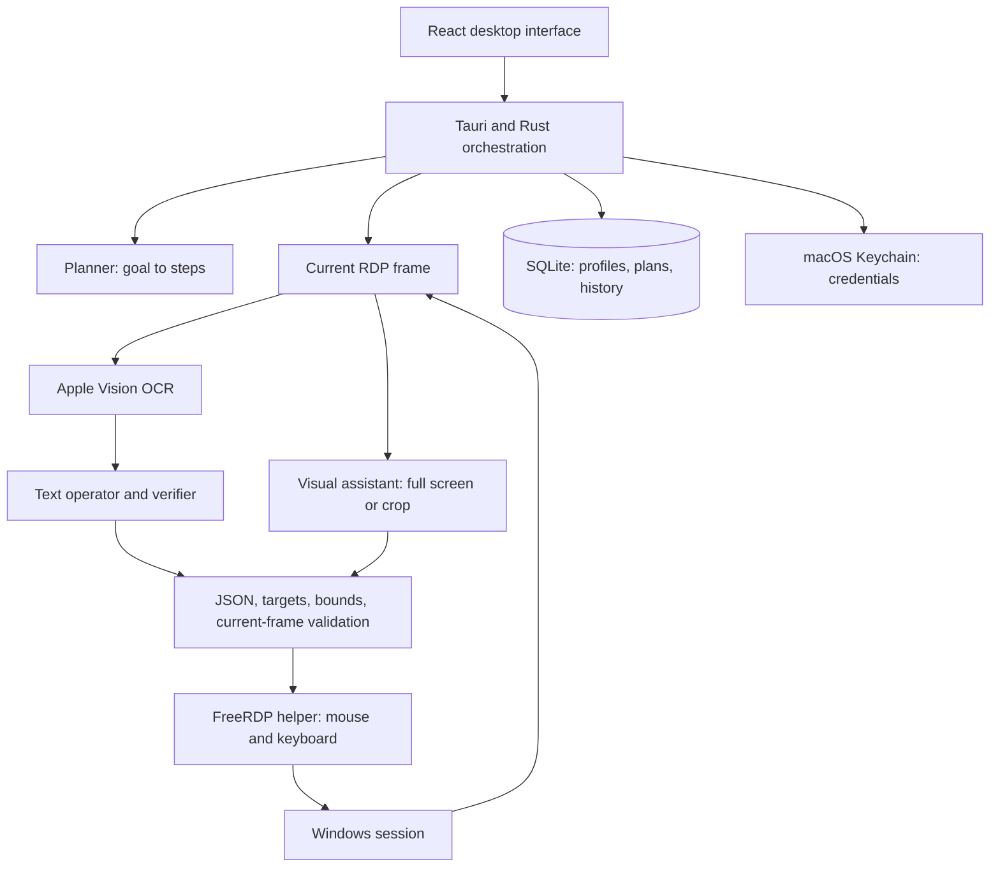

# Architecture

AgentSmith separates the interface, decision-making, validation, and remote transport. A model proposes an action; the Rust executor decides whether that action can be sent to the Windows session.

## Boundaries

| Component | Files | Responsibility |
| --- | --- | --- |
| Desktop UI | `src/App.tsx`, `SessionPanel.tsx`, feature forms | Configuration, session view, controls, progress |
| Native commands | `src-tauri/src/main.rs` | Tauri command boundary and application lifecycle |
| Executor | `executor.rs`, `repetition.rs`, `plan_edit.rs` | Planning, execution state, verification, repetition, edits |
| AI adapters | `llm.rs`, `browser_auth.rs`, `harness.rs` | Routing, provider protocols, official clients, structured contracts |
| Observation | `observation.rs`, `ocr.rs`, `vision.rs` | OCR, bounded context, exact-pixel caching, crops and coordinates |
| Remote transport | `remote.rs`, `native/rdp_worker.c` | FreeRDP process, frame stream, validated input |
| Local inference | `local_engine.rs`, `local_models.json` | Pinned downloads, on-demand llama.cpp server, lifecycle |
| Persistence | `store.rs`, `model.rs` | SQLite state, credential bindings, serialized data |

## Execution flow

The user reviews the generated plan before execution. Each step has an action description and expected outcome. The executor observes the session, checks whether the result is present, requests the next action if needed, validates it, records intent, transmits it, and observes again.

When Operate and Verify share a route, one text call may combine the decision. Text-proposed success receives a visual check against the original criterion. Explicit OCR text/region rules use direct engine checks instead. The [harness](operator-harness.md) describes contracts and recovery limits.

Pause and stop invalidate in-flight decisions. An image that changed while the model was responding cannot authorize a stale click. After a process restart, interrupted work requires review and manual reconnection. Graphical operations are not exactly-once transactions: an input may have taken effect just before a disconnect.

## Remote sessions

FreeRDP runs as a child process with private pipes for session configuration, frames, and input. The RDP desktop is separate from the Mac desktop. A detached window shares the same native session and executor; detaching does not establish a second connection.

Display resolution and Windows scale are connection settings. View zoom changes presentation. Reduced/cropped model images retain coordinates that the engine maps back into the original remote frame and validates.

RustDesk and NanoKVM entries reserve extension points but are disabled for connection. A future adapter must expose current frames, input control, identity, lifecycle, and cancellation. Merely launching another remote-access client does not satisfy that boundary.

## Persistence and inference

SQLite holds machine metadata, profiles, plans, logs, and progress. Keychain holds API keys and optional Windows passwords, bound to the associated profile or machine endpoint. Task text and evidence may still contain sensitive information; the SQLite database has no additional application-level encryption.

The built-in llama.cpp server uses loopback, an ephemeral port/token, bounded context, one active model, and on-demand lifecycle management. Local-only routing rejects non-loopback inference endpoints and cloud browser-login profiles. Downloading weights and installing dependencies still require network access.

## Deliberate limits

One active remote session/executor; no Windows controller build, background service, automatic reconnection, UI Automation tree integration, or universal cross-provider accuracy guarantee. Screens and documents are untrusted input. Prompt instructions and validation reduce risks but do not guarantee immunity to prompt injection.
