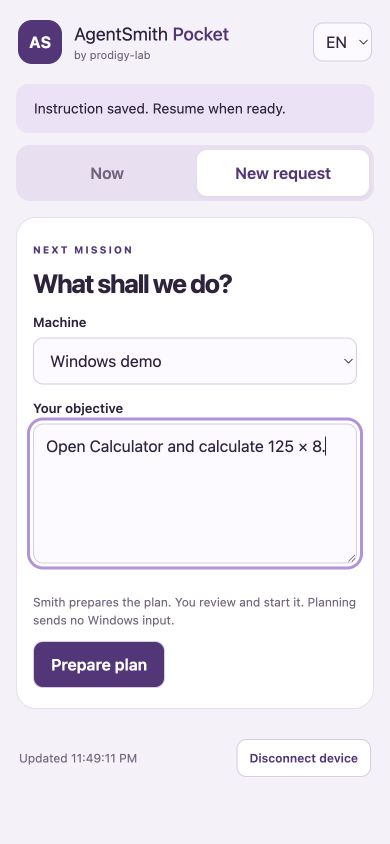

# AgentSmith Pocket

Pocket is a small mobile web app served by AgentSmith on your Mac. Use it from Safari on iPhone or Chrome on Android, or add it to your home screen. The Mac remains the only Windows executor. Pocket works with the connected RDP or RustDesk session.



## What you can do

- Follow tasks, verified steps, progress and recent history.
- View the current Windows image, refreshed every five seconds while the screen is visible. Images stay in memory; Pocket does not save or cache them.
- Prepare a new plan for a saved machine, review its steps, then explicitly start it.
- Pause, resume and stop a task using the existing execution controller.
- Add an instruction to a paused task. It becomes part of the authorized task on the next resume; completed steps stay intact. This is task guidance, not a general chat assistant or automatic replanning.
- Enable **Ask for approval before each action** when starting or resuming. Each proposed mouse or keyboard input waits up to two minutes for one decision. Rejection, expiry or loss of the approval channel sends no input. The engine checks the screen again after approval; a changed image blocks that action and requires a new observation.

The approval policy is stored with the task and survives restarting the Mac app. A notification, or simply opening its link, never approves an action. Approving a keystroke such as Enter authorizes that input and its effects in the current Windows application; review the plan, screen and proposed input together.

## Private access with Tailscale

1. Install and connect Tailscale on the Mac and your phone, in the same tailnet. Restrict access to the devices/users you intend to control AgentSmith.
2. On the Mac, configure HTTPS forwarding to Pocket:

   ```sh
   tailscale serve --bg http://127.0.0.1:17420
   ```

   If you already use Serve on HTTPS port 443, review your existing configuration first. Pocket expects the root of a dedicated Tailscale HTTPS origin. It does not configure or replace Serve automatically.
3. Copy the HTTPS address shown by Tailscale (for example, `https://my-mac.example.ts.net`). In AgentSmith, open **Alerts and decisions → AgentSmith Pocket**, enter that address and turn Pocket on.
4. Scan the pairing QR with your phone. Open the page and tap **Pair this device**. A QR is valid for five minutes and one use; generating another invalidates the previous one.
5. Optionally add Pocket to the home screen. Keep AgentSmith running and Tailscale connected on both devices.

The embedded HTTP server listens only on `127.0.0.1:17420`, never on your LAN interface. Use **Tailscale Serve**, whose access is private to your tailnet. Do not expose this port with Funnel, public proxies or router forwarding. The app validates the configured host and rejects cross-origin commands, but cannot inspect or enforce your tailnet ACLs or prevent an administrator from publishing a proxy.

Pairing creates a Secure, HttpOnly, SameSite cookie with a twelve-hour lifetime. Up to eight devices can be paired. Signing out revokes that device. **Turn off and revoke access** revokes every device and pending pairing; closing AgentSmith does the same. Pocket must be turned on again after restarting the app. Credentials, pairing secrets and device sessions are not written into the repository or task database.

## Approvals and messages

Pocket shows pending approvals inside the panel. Keep the panel open to see new requests; it does not send background push notifications. Approving, rejecting, pausing and stopping need no external notification service.

The optional SimpleX integration in **Alerts and decisions** remains available for task outcome messages and blocked-task decisions. It is separate from Pocket’s per-input approvals.

## Limits and troubleshooting

- Connect the Windows machine from the Mac first. Pocket does not expose credentials, connection setup, manual mouse control or an arbitrary command terminal.
- AgentSmith still runs one task at a time. New plans are drafts and may be prepared independently; a second execution cannot start concurrently.
- Pause and wait before adding guidance. Edits use the task revision and reject stale requests. A new objective that changes the steps should be submitted as a new plan.
- The default mobile start option requests approval before every input. You may switch it off before starting/resuming if you want the existing autonomous execution behavior.
- An approval is valid only while the engine is waiting for it. Pause, stop, expiry and disconnect invalidate that wait. If you close the app while a guarded run is active, resume it with Pocket enabled.
- If the Mac or VPN is unavailable, controls stop working and the displayed screenshot is removed. Reconnect before retrying. The panel has no offline task cache.
- If a request times out, refresh task history before submitting it again. A disconnected planning request may already have created a draft.
- The shell is installable but intentionally has no offline mode. UI labels support Portuguese, English and Spanish; provider responses and task content retain their original language.

## References

- [Tailscale Serve](https://tailscale.com/docs/features/tailscale-serve)

## Validation for 0.15.1

The release was checked with 132 passing Rust tests (two environment-dependent tests ignored), 27 frontend tests, a native macOS build and local signature verification. The Pocket tests cover private origins, authentication, pairing reuse/expiry, session revocation, stale edits, wrong-task pause, one-time approval, rejection, expiry and cancellation. The mobile layout and instruction form were exercised against fictional data in a browser at phone width. A complete Windows task approved from a physical phone remains a device-level acceptance check.
