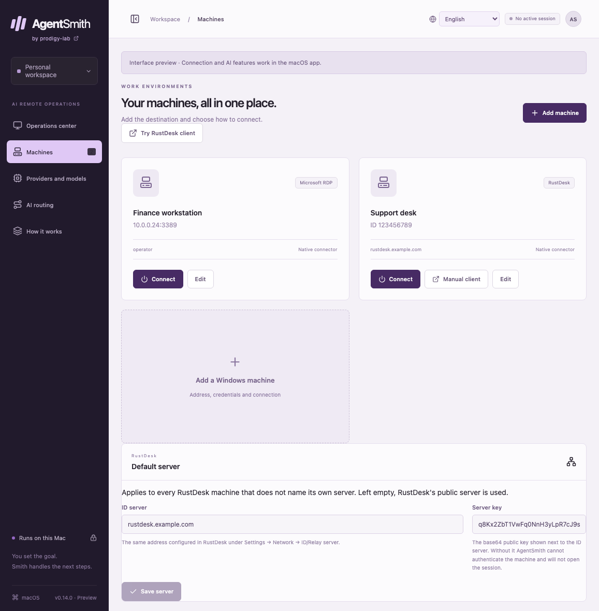
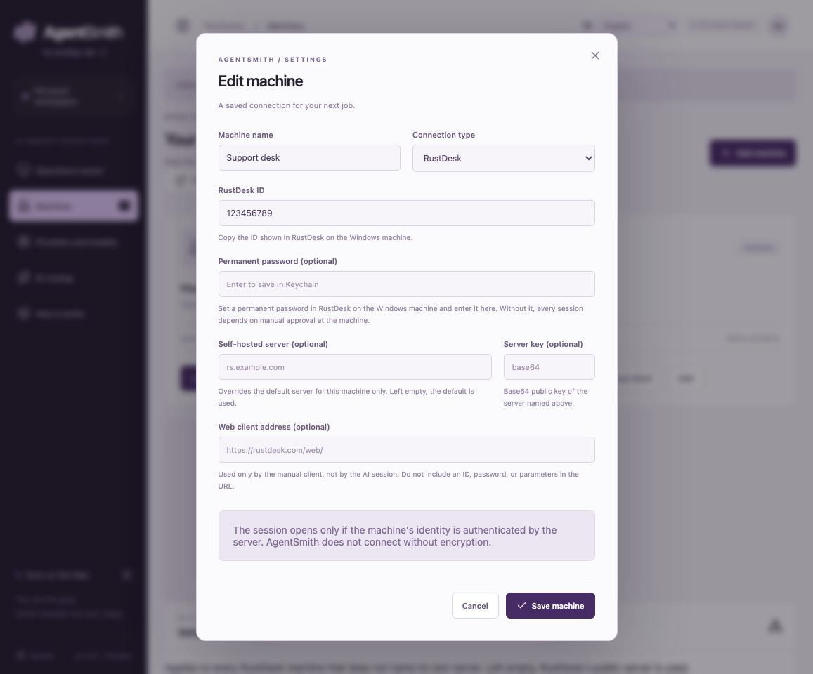
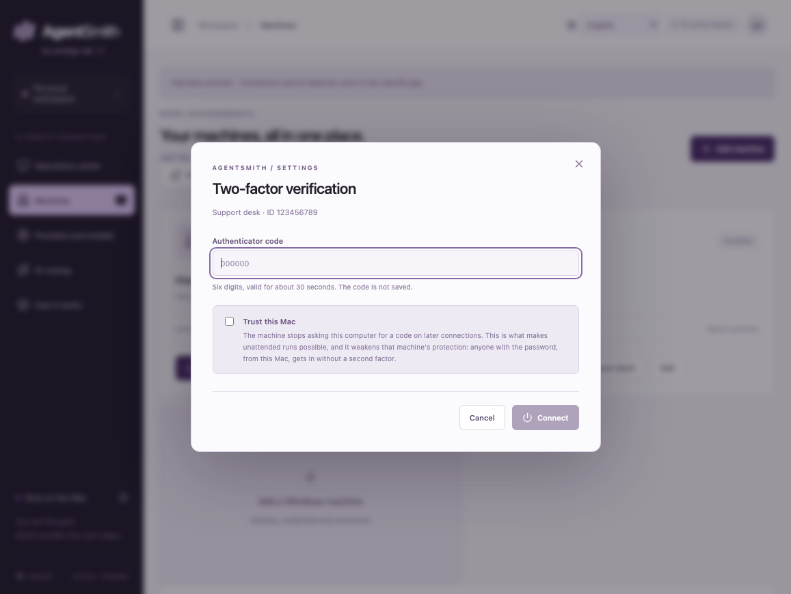
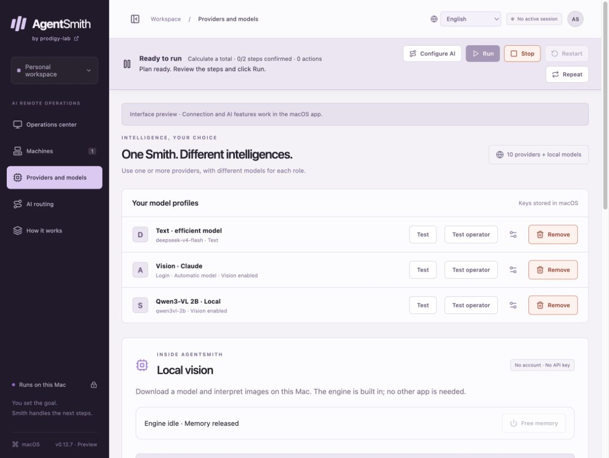
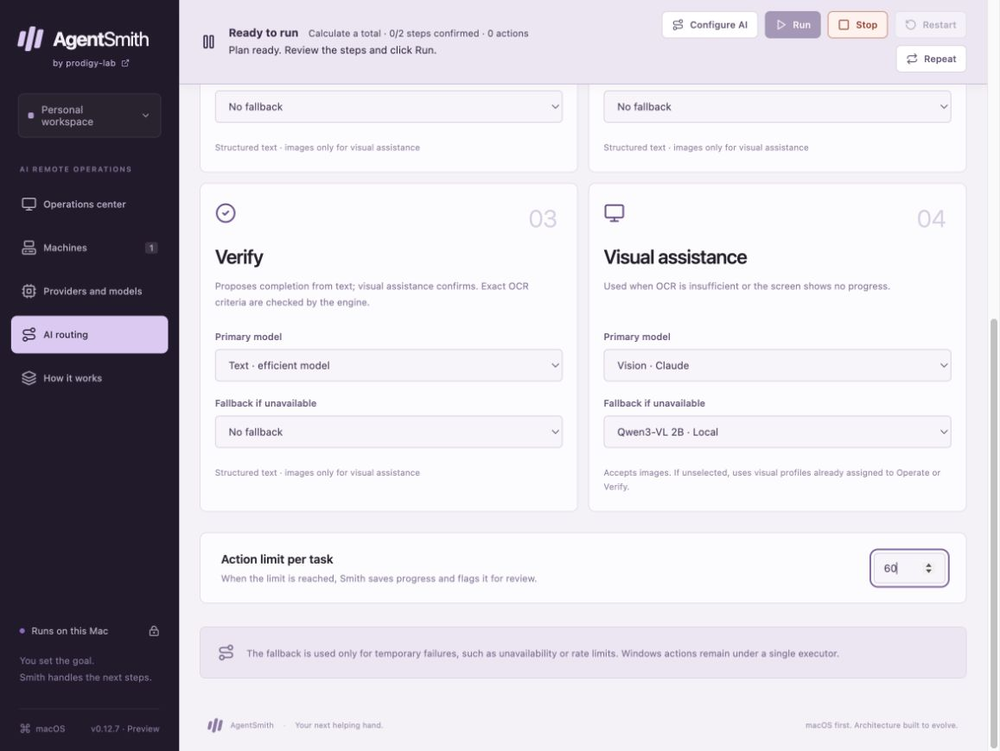
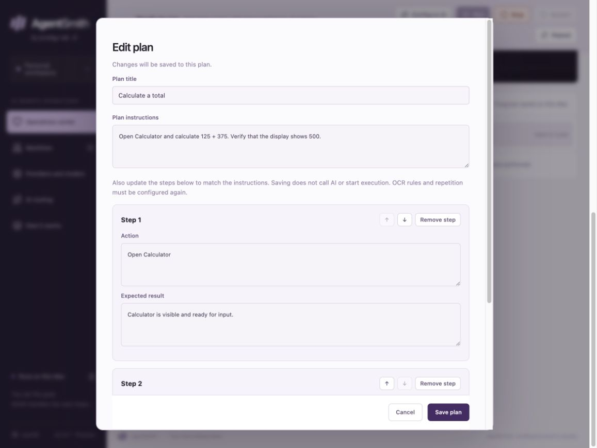
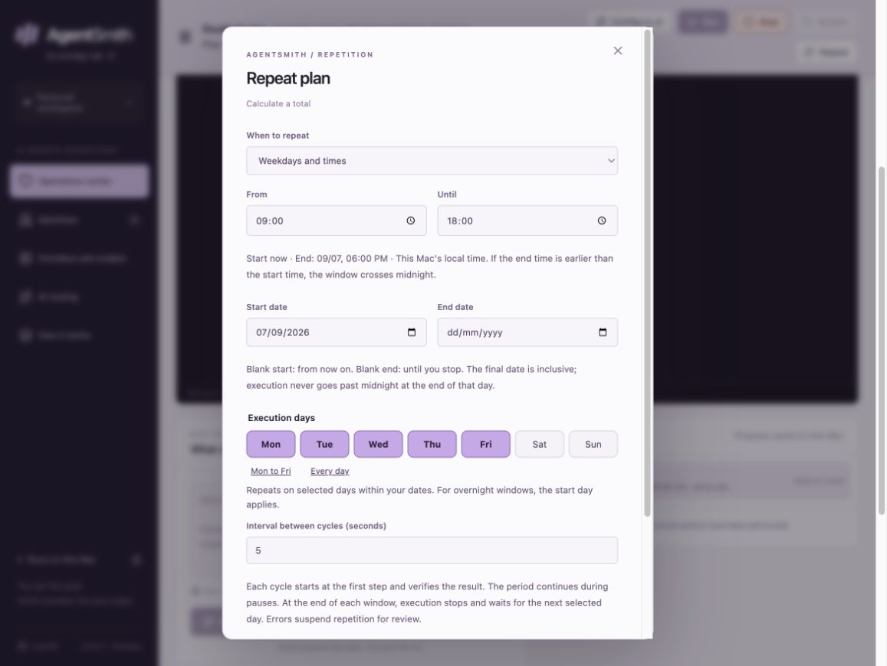
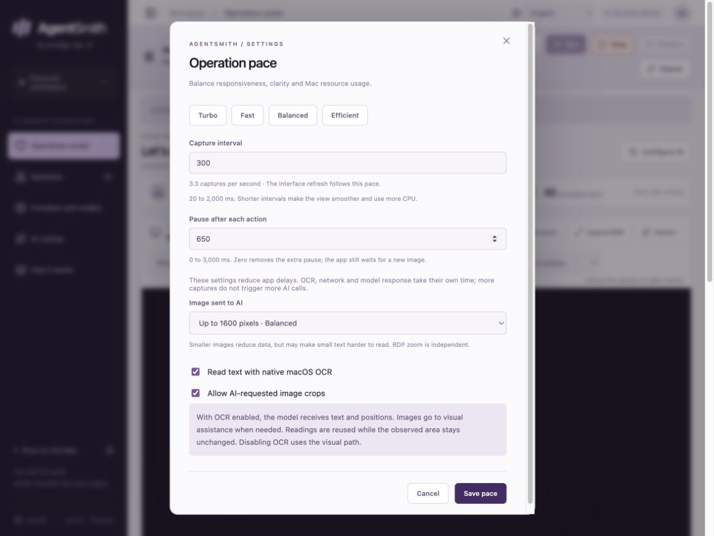

# English interface tour

These are screenshots of the real React UI, rendered in an isolated browser preview with fictional data. The Machines page and the two RustDesk dialogs are from version 0.14.0; the others are from 0.12.7 and unchanged since. They are not fabricated product mockups or evidence of a completed Windows task. Native connections, model downloads, and execution are unavailable in this preview. No personal workspace data, live remote desktop, credential, or account session was used.

## Operations center

Connection controls, task progress, remote view, and space-saving controls.

## Machines

A fictional Windows host and the available RDP connector.

The RustDesk card offers **Connect** for a native session and **Manual client** for the web client. The **Default server** panel holds a self-hosted rendezvous server and its key once, for every RustDesk machine.

### Adding a RustDesk machine

The ID as RustDesk shows it, the machine's permanent password for the Keychain, an optional server and key that override the default for this machine only, and the web-client address used by the manual client alone.

### Two-factor verification

A machine with two-factor authentication asks for the current code. **Trust this Mac** is unticked and says what it gives up; it is disabled when the machine does not keep trusted devices.

## Providers and models

Example text, browser-login vision, and local profiles. No accounts are connected in this preview.

## Planning and operation

Text profiles assigned to planning and operation.

## Verification and visual assistance

A separate visual profile and configured fallback.

## Plan editing

Editable instructions, actions, and expected results.

## Repetition

Weekdays, time windows, date bounds, and cycle interval.

## Operation pace

Capture frequency, settling delay, image width, OCR, and crops.

## Capture method

A temporary copy of the frontend was initialized with one `windows.example.com` machine, three fictional model profiles, and a two-step Calculator plan. The ordinary native-feature guard remained active. Language was selected through the UI; captures contain no active RDP session. Only the resulting reviewed PNGs are published.
